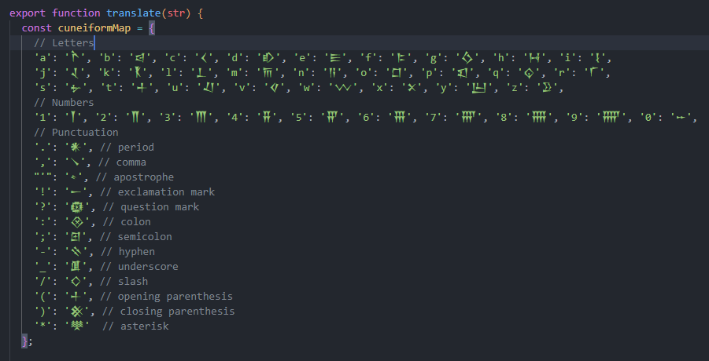

# Cuneiform Translator Bot

This discord bot is designed to translate text between modern languages and pseudo cuneiform.

## Usage

1. Add the bot to your server / user
2. Use /translate Hello world to convert text to pseudo cuneiform
3. Use /untranslate 𒀂𒀼𒁇𒁇𒆸 𒉼𒆸𒇲𒁇𒁓 to convert pseudo cuneiform to text

## Features

- Supports letters with accents
- Translate modern text to pseudo cuneiform.
- Translate pseudo cuneiform to modern text
- Use it in any Discord server with a User Install

## Supported Characters

The bot supports a wide range of characters for translation. Below is a preview of the supported characters:

## Credits

- [YayText Cuniform](https://yaytext.com/cuniform/) for most symbols
- [Discord Developer Portal](https://discord.com/developers/docs/quick-start/getting-started#step-2-running-your-app) for the code basis
